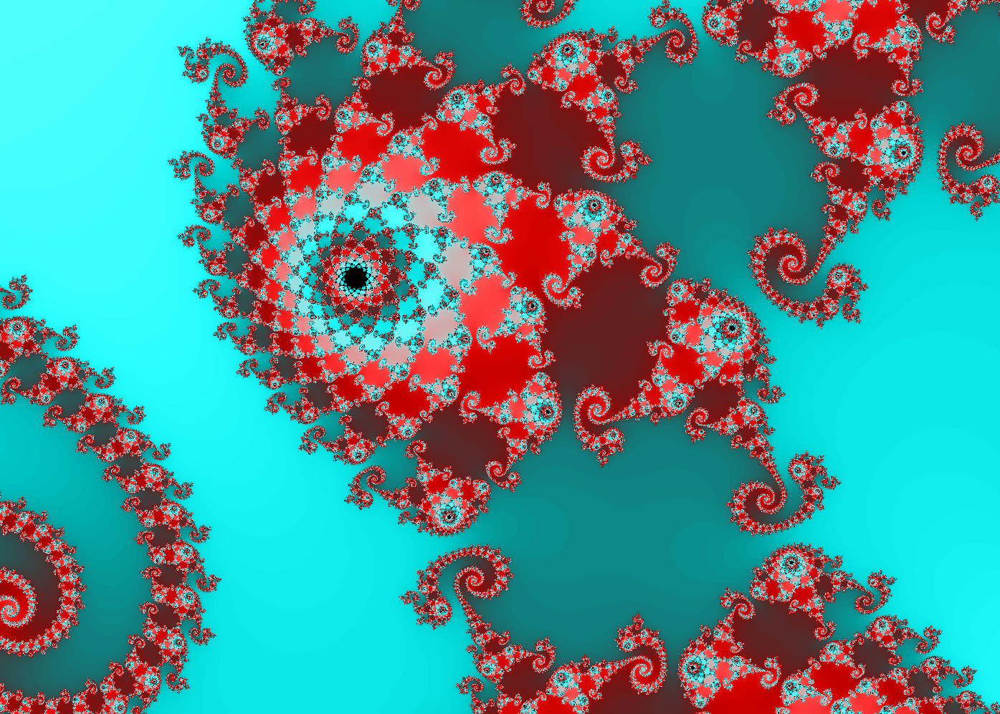
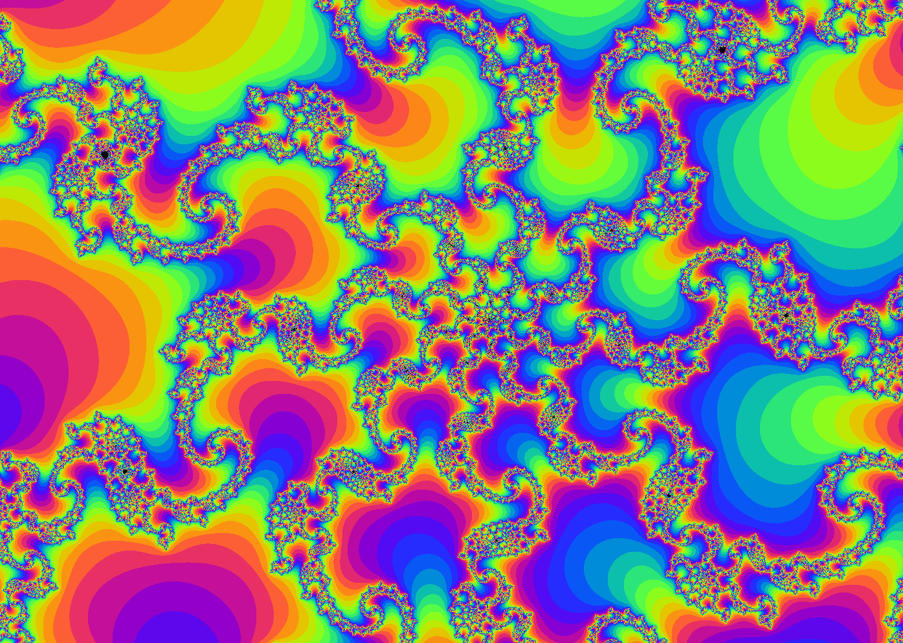
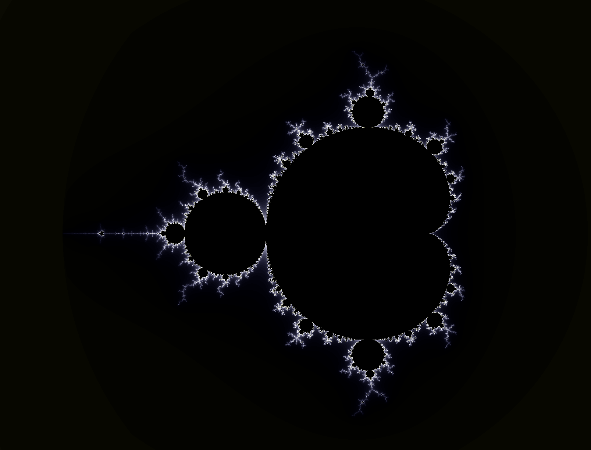
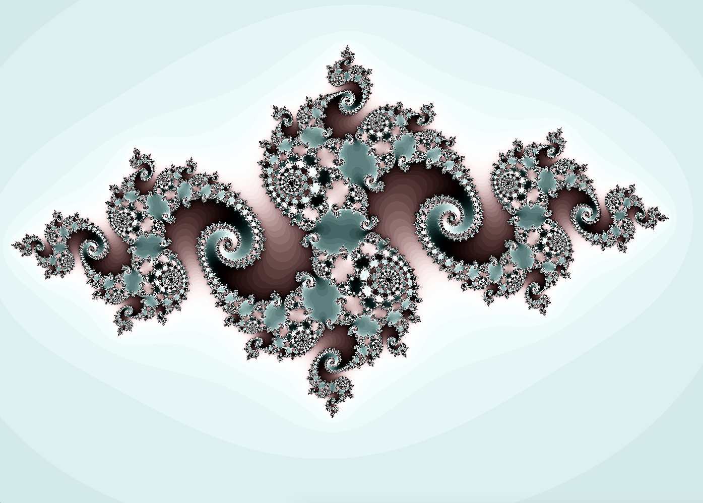

  

# Fractol

## Introduction
Ce projet est une ouverture à la programmation graphique, aux nombres complexes et aux differentes problematiques lier a l'optimisation.

42 subject: [https://cdn.intra.42.fr/pdf/pdf/84885/en.subject.pdf](https://cdn.intra.42.fr/pdf/pdf/1823/fract_ol.fr.pdf)

L'Objectif ici est de creer un petit logiciel d'exploration de fractales sur different sets de fractales tel que Mandelbrot et Julia.

## Content
Il est possible d'afficher 4 types de fractales differentes:
  - Julia
  - Mandelbrot
  - Burning Ship
  - Multibrot (Mandelbrot variations)

> [!NOTE]
> Due aux contraintes materiel et à la complexité accrue, le set Multibrot peut être plus lent que les autres sets disponibles.

Voici la liste des actions disponible durant le rendu des fractales:
  - La molette de la souris permet de zoomer et dézoomer, et cela de façon quasi infinie (modulo les limites de la machine).
  - 'Q', 'E' - changer de set de fractale (voir liste ci-dessus).
  - 'Z', 'X' - ...
  - 'R', 'G', 'B' - changer le colori des fractales (rouge/vert/bleu).
  - 'UP', 'DOWN', 'LEFT', 'RIGHT' - se déplacer dans la fractale horizontalement et verticalement.
  - 'W', 'S' - faire varier la couleur suivant un gradiant.
  - 'A', 'D' - changer le mode de colori.
  - 'SPACE' - permet de bloquer/débloquer la variation du set (Julia seulement).
  - '+', '-' - Augmente ou diminue le nombre d'iterations/profondeur de la fractale (Passer un certain ceuil technique, affecte la performance)
  - 'ECHAP' - Quitte le programme.
  - 'Z', 'X' - (seulement pour Mandelbrot) permet de passer de Mandelbrot à sa variante multibranches (Multibrot) 'Z' et 'X' permettent de changer le nombre de branches.

## Run program
Compile using the Makefile:
`make` / `make re`

Usage : `./fractol [fractal_name]`
with fractale_name:
  - Mandelbrot
  - Julia
  - BurningShip

> [!NOTE]
> For the Multibrot set, you have to select Mandelbrot and change the number of branches with 'Z' and 'X'.

## Screenshots

